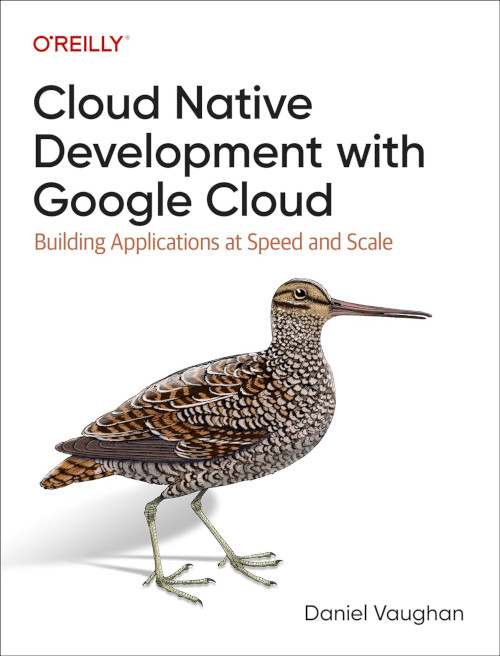

Cloud native development gives you the power to rapidly build, secure, and scale software. But you still
need to navigate many potential pitfalls along the way. Through practical examples, this book
demonstrates how to use Google Cloud as a laboratory to enable rapid innovation, a factory to automate
build and testing, and a citadel to operate applications at scale securely.

In this book I am to show you how to take applications from prototype to production by combining Google
Cloud services, a cloud native programming model, and best practices. By following an example project
from start to finish, developers, architects, and engineering managers working with the Google Cloud
Platform will learn how to build and run cloud native applications on Google Cloud with confidence.

With this book, you will:

* Understand cloud native development concepts including microservices, containerization, and event-driven architecture
* Learn Google Cloud services that specifically support this development style: compute, persistence, messaging, DevOps,
  security and networking, and observability
* Confidently build cloud native applications on Google Cloud<
* Learn how to address nonfunctional requirements such as security, observability, and testing
* Successfully make the transition from initial proofs of concept and prototypes to production systems

## Read the Book

Cloud Native Development with Google Cloud is available from many places, including the following:

* [Read online on O'Reilly.com](https://learning.oreilly.com/library/view/programming-cloud-native/9781098145071/)
* [Amazon.com](https://www.amazon.com/Programming-Cloud-Native-Applications-Google/dp/1098145089/)
* [Amazon.co.uk](https://www.amazon.co.uk/Programming-Cloud-Native-Applications-Google/dp/1098145089/)

## Find Out More

To get the latest information please visit [DanielVaughan.com](https://danielvaughan.com/).

